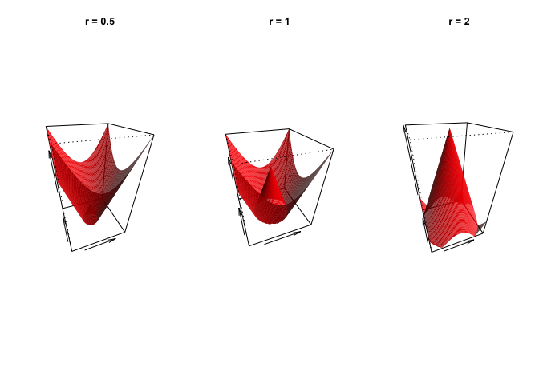
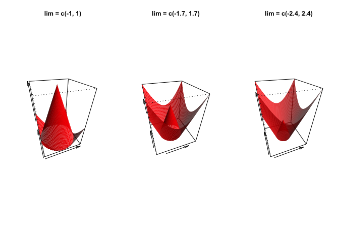
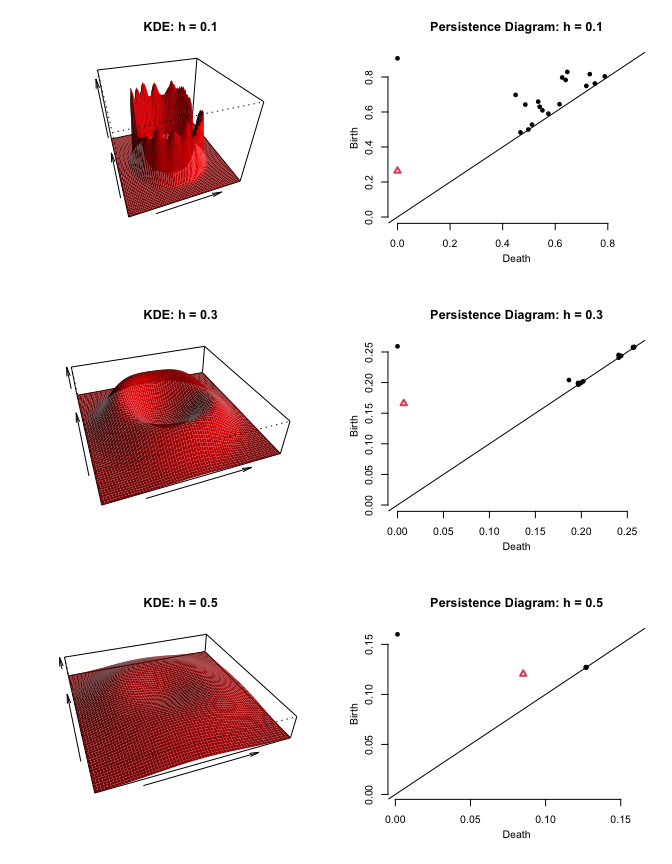
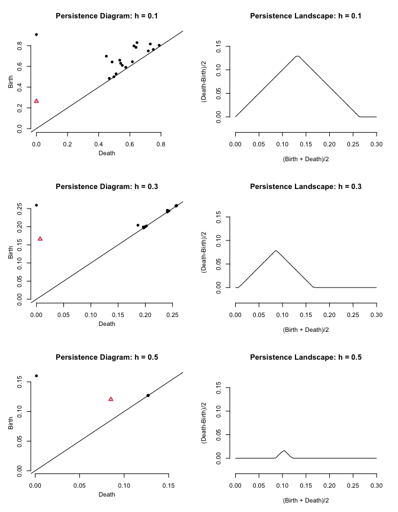
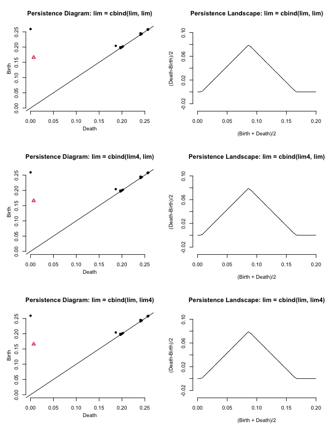

Introduction to Topological Data Analysis and Statistical Testings in R
================
My Le
6/21/2021

  - [Introduction](#introduction)
  - [Getting Started](#getting-started)
  - [A. Distance Function Over a Grid of
    Points](#a.-distance-function-over-a-grid-of-points)
      - [1. Compute Distance Function](#compute-distance-function)
      - [2. Modify the Inputs](#modify-the-inputs)
          - [a. Modify the Size of Sample
            X](#a.-modify-the-size-of-sample-x)
          - [b. Modify the Radius of Circle
            C](#b.-modify-the-radius-of-circle-c)
          - [c. Modify the Grid Size](#c.-modify-the-grid-size)
          - [d. Modify the Grid Cell
            Size](#d.-modify-the-grid-cell-size)
          - [e. Modify the Grid Shape](#e.-modify-the-grid-shape)
  - [B. Kernel Density Estimator Over a Grid of
    Points](#b.-kernel-density-estimator-over-a-grid-of-points)
      - [1. Compute KDE](#compute-kde)
      - [2. Modify the Inputs](#modify-the-inputs-1)
          - [a. Modify the Smoothing
            Parameter](#a.-modify-the-smoothing-parameter)
          - [b. Modify the Size of Sample
            X](#b.-modify-the-size-of-sample-x)
          - [c. Modify the Radius of Circle
            C](#c.-modify-the-radius-of-circle-c)
          - [d. Modify the Grid Size](#d.-modify-the-grid-size)
          - [e. Modify the Grid Cell
            Size](#e.-modify-the-grid-cell-size)
          - [f. Modify the Grid Shape](#f.-modify-the-grid-shape)
  - [C. Persistent Homology Over a
    Grid](#c.-persistent-homology-over-a-grid)
      - [I. Persistence Diagram](#i.-persistence-diagram)
          - [1. Create Persistence Diagram](#create-persistence-diagram)
          - [2. Modify the Inputs](#modify-the-inputs-2)
              - [a. Modify the Smoothing
                Parameter](#a.-modify-the-smoothing-parameter-1)
              - [b. Modify the Size of Sample
                X](#b.-modify-the-size-of-sample-x-1)
              - [c. Modify the Radius of Circle
                C](#c.-modify-the-radius-of-circle-c-1)
              - [d. Modify the Grid Size](#d.-modify-the-grid-size-1)
              - [e. Modify the Grid Cell
                Size](#e.-modify-the-grid-cell-size-1)
              - [f. Modify the Grid Shape](#f.-modify-the-grid-shape-1)
              - [g. Use Sublevel and Superlevel
                Sets](#g.-use-sublevel-and-superlevel-sets)
      - [II. Persistence Landscape Over a
        Grid](#ii.-persistence-landscape-over-a-grid)
          - [1. Create Persistence
            Landscape](#create-persistence-landscape)
          - [2. Modify the Inputs](#modify-the-inputs-3)
              - [a. Modify the Size of the Sampling
                Region](#a.-modify-the-size-of-the-sampling-region)
              - [b. Modify the Number of Points to Be
                Evaluated](#b.-modify-the-number-of-points-to-be-evaluated)
              - [c. Modify the Smoothing
                Parameter](#c.-modify-the-smoothing-parameter)
              - [d. Modify the Size of Sample
                X](#d.-modify-the-size-of-sample-x)
              - [e. Modify the Radius of Circle
                C](#e.-modify-the-radius-of-circle-c)
              - [f. Modify the Grid Size](#f.-modify-the-grid-size)
              - [g. Modify the Grid Cell
                Size](#g.-modify-the-grid-cell-size)
              - [h. Modify the Grid Shape](#h.-modify-the-grid-shape)
              - [i. Use Sublevel and Super Level
                Sets](#i.-use-sublevel-and-super-level-sets)
          - [3. Statistical Testing Involving Persistence
            Landscapes](#statistical-testing-involving-persistence-landscapes)
              - [a. Prepare Data for
                T-Test](#a.-prepare-data-for-t-test)
              - [b. Perform T-Test](#b.-perform-t-test)
                  - [i. T-test for Persistence Landscapes of Rank
                    1](#i.-t-test-for-persistence-landscapes-of-rank-1)
                  - [ii. T-test for Persistence Landscapes of Rank
                    2](#ii.-t-test-for-persistence-landscapes-of-rank-2)
              - [c. More About T-Test](#c.-more-about-t-test)
  - [Conclusion](#conclusion)
  - [Acknowledgement](#acknowledgement)
  - [Reference](#reference)

## Introduction

The objective of this document is to help the readers understand the
main concepts in Topological Data Analysis (TDA), which uses principles
from algebraic topology to comprehensively measure and get insights from
the shape of complex data. Besides giving a brief introduction of
distance function, kernel density estimator, persistence homology, and
statistical testings involving these topological techniques, this
document focuses on guiding the users through steps of performing TDA in
R and extracting meaningful generalizations from the results. Due to the
flexibility of TDA in dealing with complex data sets, this work is a
valuable resource that helps applied mathematicians and data scientists
obtain a more complete understanding of their data.

## Getting Started

There are several R packages that allow users to make use of topological
techniques to obtain insights from a data set. In this document, we are
going to use the package `TDA`.\(^1\)

``` r
library(TDA)
```

Next, we generate a toy data set to practice using topological tools.
One of the most frequently used toy data sets is the uniform sample on a
circle in \({\mathbb{R}}^2\). We create it by using the command
`circleUnif` with the inputs `n=20` and `r=1` for 20 randomly generated
data points on the edge of a circle of radius 1 centered at (0, 0). The
point cloud can then be visualized by plotting it on a 2D plot (see
**Figure 1**). `-lab` is to set the axis label. `pch` is to select the
shape for points shown on the plot, and 20 is the index for choosing the
small black circular shape. Note that we also specify a seed so that our
results will not be altered due to random generation of data.

``` r
set.seed(0)
circleSample <- circleUnif(n = 20, r = 1)
plot(circleSample, xlab = "", ylab = "", pch = 20)
```

<div class="figure" style="text-align: center">


<p class="caption">

<b>Figure 1. Generate a Uniform Sample on a Circle</b>

</p>

</div>

Now that we have a data set to work with TDA, we proceed to the next
step to learn important features in TDA.

## A. Distance Function Over a Grid of Points

One of the most basic methods for building a surface from a sample of
points is to use a distance function. The distance function computes the
distance between the grid points and the corresponding closest point of
the data. Thus, the closer the point is to a grid point, the lower the
z-value.

#### 1\. Compute Distance Function

To understand the distance function in R, we follow the instructions
given by Brittany et al.\(^2\) to generate a toy data set, then compute
and plot the distance function. The data we generate is a new uniform
sample of 400 points on the circle of radius 1 with the center at (0,
0). We call the sample of points X and circle C.

Subsequently, we create a grid which we will use to make a surface from
the point cloud. Keep in mind that we need a surface to perform TDA. In
this case, we build a square grid `Grid` from two identical sequences of
numbers called `margin`. The sequence takes -1.7 as the lower bound, 1.7
as the upper bound, and 0.05 as the difference between two consecutive
numbers in the sequence (also known as step number). As a result, each
of the numbers in the sequence gives data on the location of a
particular row or column in the grid. We also notice that all of the
cells in `Grid` are squares because the two number sequences that we
used to create `Grid` have the same step number.

``` r
set.seed(0)
X <- circleUnif(n = 400, r = 1)
lim <- c(-1.7, 1.7)
by <- 0.05
margin <- seq(from = lim[1], to = lim[2], by = by) 
Grid <- expand.grid(margin, margin)
```

After preparing the point cloud X and the grid `Grid`, we use the
function `distFct` to obtain the distance function. `distFct` returns a
numeric vector with the length equal to the number of points stored in
`Grid`. Then, we use `par(mfrow = c(nRows, nFigures))` to specify how
the graphs are arranged in the output with `nRows` and `nFigures` being
the number of rows and the number of figures shown on each row,
respectively. Again, we use the function `plot` to visualize the sample
of 400 points. main is to set the title of the plot. Then, we use the
function grid to add the gridlines corresponding to the columns and rows
in `Grid` when plotting the point cloud X. `nx` and `ny` are the numbers
of cells of the grid in the x- and y-direction. `lyt` is used to select
the line type for the gridlines.

To observe the shape of the distance function, we use `persp` to create
a 3D plot with `x` and `y` taking `margin` as the input. By doing this,
the intersections of all the rows and columns in `Grid` will be
analyzed. The input for `z` is a matrix that stores the values of the
distance function at all the intersections mentioned above—`nrow` and
`ncol` are to specify the number of rows and columns in the grid, both
of which are equal to the number of elements in `margin`.

The parameters other than those mentioned above control how the 3D plot
is shown in the output:

  - `theta` and `phi` are to set the degree of horizontal and vertical
    rotation of the 3D plot.
  - Before showing the 3D plot, the x, y, and z coordinates defining the
    surface are normalized to the interval \[0, 1\]. If `scale = FALSE`,
    the coordinates are scaled so that aspect ratios are retained. In
    other words, the surface of the distance function within the chosen
    limit will be contained in a cube. If `scale = TRUE`, the x, y, and
    z coordinates are transformed separately so that the surface of the
    distance function is also contained in a box of six surfaces, but
    these surfaces will be rearranged in space in a way that minimizes
    the volume of the box.
  - `expand` is used as an expansion factor applied to the z
    coordinates. The higher the value assigned to expand, the more the
    expansion in the vertical direction.
  - `col` is used to select the color of the surface facets.
  - `border = NA` is to disable the drawing of borders. Otherwise, the
    color of the line drawn around the surface facets will be shown.
  - `ltheta` is to select the shaded region. if `ltheta = Inf`
    (infinity), there will be no shaded on the surface of the graph.
  - `shade` is to control the color of the shade. Values of shade close
    to one yield shading similar to a point light source model, and
    values close to zero produce no shading.

<!-- end list -->

``` r
set.seed(0)
distance <- distFct(X = X, Grid = Grid)
par(mfrow = c(1, 2))
plot(X, xlab = "", ylab = "", main = "Sample X", pch = 20)
grid (nx = 68, ny = 68, lty = 1)
persp(x = margin, y = margin, z = matrix(distance, nrow = length(margin), ncol = length(margin)), xlab = "", ylab = "", zlab = "", theta = -20, phi = 35, scale = FALSE, expand = 3, col = "red", border = NA, ltheta = 50, shade = 0.5, main = "Distance Function")
```

<div class="figure" style="text-align: center">


<p class="caption">

<b>Figure 2. Distance Function Resulting from X and `Grid`</b>

</p>

</div>

#### 2\. Modify the Inputs

To better understand the distance function, we set all the inputs that
are used earlier in \(A.1\) as default and change one single input each
time (if not otherwise specified) to see how it affects our distance
plots.

##### a. Modify the Size of Sample X

In this part, we are going to compare the 3D plots created using the
uniform sample of different sizes: 20 points, 100 points, and 500
points.

<div class="figure" style="text-align: center">


<p class="caption">

<b>Figure 3. Distance Function: Modify the Size of Sample X</b>

</p>

</div>

It is clear from **Figure 3** that the surface resulting from 20 data
points is not as smooth as that obtained from 100 points. Since 100 is a
quite high number and the corresponding surface appears to be
considerably smooth, we do not see any significant changes to the 3D
plot if we instead use a sample of more than 100 points. Thus, any
number equal to or above 100 is good. However, we also need to keep in
mind that the higher the number of points, the higher the cost of
computation.

##### b. Modify the Radius of Circle C

Note that our uniform sample X is generated with circle C as the base.
Now, we test the change in the distance surface as we set the radius of
C to 0.5, 1, and 2.

<div class="figure" style="text-align: center">



<p class="caption">

<b>Figure 4. Distance Function: Modify the Radius of Circle C</b>

</p>

</div>

From **Figure 4**, we observe two clear changes as we change the
circle’s radius. The first one is the change in the size of the cone
as its base is circle C whose radius is adjusted. Secondly, we see that
the smaller the cone, the larger space there is within the grid limit
that allows the distance surface to spread out. One take-away point here
is that we need the grid space to match the surface space. In this
example, the fit grid is too big, and so we get the large walls around
our cone. In contrast, the last one is too small, cutting off the edges
of our cone. This will lead to the same result when we change the grid
size in the next section.

##### c. Modify the Grid Size

Now, we compare the 3D plots resulting from different choices of grid
limit: (-1, 1), (-1.7, 1.7), and (-2.4, 2.4). Notice that (-1.7, 1.7) is
the grid limit that we initially use. The two new grids with limits (-1,
1) and (-2.4, 2.4) are stored stored `Grid1` and `Grid2`, respectively,
for later use. Note that we need to replace `margin` with the number
sequences that are used to create the new grid; otherwise, our code will
not work appropriately.

<div class="figure" style="text-align: center">



<p class="caption">

<b>Figure 5. Distance Function: Modify the Grid Size</b>

</p>

</div>

Although the grid limit has nothing to do with the radius of C, changing
the value of this parameter has the same visualizing effect as changing
the size of the circle. That is, as **Figure 5** shows, the wider the
limit, the larger the space there is within the grid limit that allows
the distance surface to spread out. Once again, we are looking to get
the right fit between the grid and the data, not too big or small. It is
also important to keep in mind that changing the limit of the grid does
not affect the value of distance function at a certain point while
changing the radius of the circle does.

##### d. Modify the Grid Cell Size

We again set everything back to default, except that the size of the
cells in `Grid` will be altered (0.02, 0.1, or 0.5). Note that the cells
are equal in size, and the size is equal to the step number in `margin`.
We call these new grids `Grid3`, `Grid4`, and `Grid5`. We also need to
replace `margin` with the sequences of numbers that correspond to the
new grids.

<div class="figure" style="text-align: center">


<p class="caption">

<b>Figure 6. Distance Function: Modify the Grid Cell Size</b>

</p>

</div>

The smaller the cells, the more intersections of rows and columns in the
grid, and therefore the smoother the distance surface, which is
consistent with what we observe from **Figure 6**. Since `by = 0.1`
yields a considerably high number of intersections, there is no
significant change to the distance surface as we keep lowering the input
for this parameter. Thus, any step number of 0.1 or below is a good fit
to avoid sampling artifacts in the distance surface. However, we want to
keep in mind that more intersections to be evaluated means higher
computational costs.

##### e. Modify the Grid Shape

Instead of building a square grid containing equal square cells from two
identical number sequences, we can instead use two different sequences
to adjust the shape of both the grid and its cells. **Figure 7**
displays three different plots resulting from three different grid
shapes. We use two different sequences `newSeq1` and `newSeq2` to create
the new grids, `Grid6`, `Grid7`, and `Grid8`. `newSeq1` shares the same
limit with `margin`, but its step number is 0.2, which is high enough
for us to clearly observe the change in the distance surface. The upper
bound of `newSeq2` is 1.5 units higher than that of `newSeq1`, while its
lower bound is 0.5 units higher than that of `newSeq1`. The step number
of this sequence is also 5 times higher than that of `newSeq1`. We let
`newSeq1` control the columns of `Grid6` and `Grid8` and the row of
`Grid6` and `Grid7`, while `newSeq2` control `Grid7`’s rows and
`Grid8`’s columns.

<div class="figure" style="text-align: center">


<p class="caption">

<b>Figure 7. Distance Function: Modify the Grid Shape</b>

</p>

</div>

By changing the step number of one sequence, we change the location of
the corresponding rows or columns and therefore obtain new rectangular
cells. This results in the change in location of the intersections which
are used to create the distance surface. Changing the limit of one
sequence, we get a rectangular grid, as can be seen in **Figure 7**.
This adjusts the space in which the surface resulting from the distance
function is allowed to spread out. This is an important feature as it
means we can create a grid that is ideal for our shape.

## B. Kernel Density Estimator Over a Grid of Points

Kernel Density Estimator (KDE) is a concept that is completely opposite
to distance function. The further the area of evaluation is from the
point cloud, the higher the value returned by the distance function,
while KDE gives a higher value where the points are denser.

Mathematically speaking, KDE gives data on the sum of the probability
over each of the data points in sample X of size `n`. To begin, we
center out Gaussian function over a point \(x_i \in\) X and obtain a
probability for all points. If a second point is relatively close to the
first, then we will have a signal at the second point. As we move
through this calculation for each \(x_i\), the density function will
sum, and so we would expect a larger signal where the points are close
together and a lower value where the points spread out. Note that the
selection of the bandwidth `h` for the Gaussian function will be
important.

KDE is favored over distance function when we are more interested in the
location of the points in the point cloud X rather than areas where
there are no points.

#### 1\. Compute KDE

We use the function `kde` to compute KDE over a grid of points. In
addition to a sample of points and a grid, `kde` also takes the
smoothing parameter `h` as an input—further investigations on `h` will
be conducted later in **C.2.a**. Note that we will again use the uniform
samples X and the grid `Grid` created in **A.1**. `kde` returns a vector
that contains the value of the KDE for each point in `Grid`.

``` r
set.seed(0)
h = 0.3
par(mfrow = c(1, 2))
plot(X, xlab = "", ylab = "", main = "Sample X", pch = 20)
grid (nx = 68, ny = 68, lty = 1)
KDE <- kde(X = X, Grid = Grid, h = h)
persp(x = margin, y = margin, z = matrix(KDE, nrow = length(margin), ncol = length(margin)), xlab = "", ylab = "", zlab = "", theta = -20, phi = 35, scale = FALSE, expand = 3, col = "red", border = NA, ltheta = 50, shade = 0.5, main = "KDE")
```

<div class="figure" style="text-align: center">


<p class="caption">

<b>Figure 8. KDE Surface Resulting from X and `Grid`</b>

</p>

</div>

#### 2\. Modify the Inputs

We will again set all the inputs in **B.1** as default and change one of
these at a time (if not otherwise specified) to study how the KDE
surface change in response to the changes in the inputs.

##### a. Modify the Smoothing Parameter

Firstly, we compare the plot with different values assigned to the
smoothing parameter `h`. We consider three values 0.1, 0.3, and 0.5.

<div class="figure" style="text-align: center">


<p class="caption">

<b>Figure 9. KDE: Modify the Smoothing Parameter</b>

</p>

</div>

As being shown in **Figure 9**, the lower the smoothing parameter, the
smoother the surface. Besides, the denser the data points are at a
certain location, the higher the z-value at that location. As we
consider what smoothing parameter to use for our data we want to smooth
the data enough to reveal the underlying shape but not too much that we
lose the feature. Here a smoothing parameter between 0.1 and 0.3 should
work.

##### b. Modify the Size of Sample X

Next, we change the sample size to 20, 100, and 500 and use `h = 0.1` so
that we can clearly see the differences in the density plots.

<div class="figure" style="text-align: center">


<p class="caption">

<b>Figure 10. KDE: Modify the Size of Sample X</b>

</p>

</div>

**Figure 10** shows that the smaller the sample size, the harder it is
to show the underlying surface. With only 20 points sampled, the shape
of the circle is not reflected on the surface. However, if we have a
more limited sample size it may be possible to use the smoothing
parameter `h` to obtain the underlying shape.

##### c. Modify the Radius of Circle C

Now, we assign different values to the radius of C (0.5, 1, and 2) to
see the change in the KDE surface. Note that we use `h = 0.1` again this
time.

<div class="figure" style="text-align: center">


<p class="caption">

<b>Figure 11. KDE: Modify the Radius of Circle C</b>

</p>

</div>

As illustrated in **Figure 11**, lowering the radius results in a more
intense plot. This is consistent with our assumption that we will detect
a larger signal where the points are closer together and a lower value
where the points are more spread out. This finding is slightly different
from what we observe in the distance plots because when we employ KDE,
the center loop will remain a clear shape no matter what size the grid
is. In contrast, the cone in the distance plot will be too small to be
visualized if the grid is too big for the surface. We still see that
when the grid is too small for the shape, we can lose the shape as the
circle with radius 2 is cut off, and we would never retrieve the circle
back.

##### d. Modify the Grid Size

Now, we change the limit of the grid to see how the density plot change.
Since we already have three grids with different limits from **A.2.c**,
we can just use them here in this part. Keep in mind that we also need
to specify the appropriate number sequences to obtain the correct
result.

<div class="figure" style="text-align: center">


<p class="caption">

<b>Figure 12. KDE: Modify the Grid Size</b>

</p>

</div>

From **Figure 12**, we observe that the space that contains the KDE
surface is adjusted. Notice that the KDE value at a certain point does
not change as the grid limit alters. The narrower the limit, the
narrower the sampling space. The ideal grid limit is one that matches
the KDE shape in size, which contains almost all parts of the point
cloud for our later evaluation. Note that if our grid is too big, we can
still observe the featured shapes of the KDE surface while the distance
surface does not allow us to do so, as explained earlier in **B.2.c**.
Changing the grid limit is just another way that we can control the
sampling of data, besides changing the radius of C. However, this one is
more favored as this does not lead to the loss of data in the original
sample of points.

##### e. Modify the Grid Cell Size

In this part, we use `Grid3`, `Grid4`, and `Grid5` created in **A.2.d**
to see the change in the density plot in response to the change in the
step number of `margin` (or the size of the cells in `Grid`). We need to
replace `margin` with the sequences of numbers corresponding to each of
the new grids.

<div class="figure" style="text-align: center">


<p class="caption">

<b>Figure 13. KDE: Modify the Grid Cell Size</b>

</p>

</div>

As can be seen from **Figure 13**, this change has the same effects as
when we perform it on the distance function. Smaller cells in the grid
give more points for computing and forming the density surface, and so,
the resulting KDE surface will be smoother. Similar to what we observe
in **A.2.d** since `by = 0.1` yields a considerably high number of
intersections and the surface is already smooth, no considerable change
is made to the distance function surface as we lower the size of the
cells. Therefore, any step number of 0.1 or below is a good choice to
produce a nice density plot, but we also want to make sure that our
chosen number is not too low in order to keep the cost of computation
not too high.

##### f. Modify the Grid Shape

This time, we use the grids created in **A.2.e** to see if the shape of
the sampling area has any effects on the density plot. We also need to
change the number sequences as how we did in **A.2.e**.

<div class="figure" style="text-align: center">


<p class="caption">

<b>Figure 14. KDE: Modify the Grid Shape</b>

</p>

</div>

In **Figure 14**, similar to our observations in **A.2.e**, we obtain
rectangular cells when two number sequences that are used to create the
grid have different step numbers. The space in which the KDE surface can
spread out is also expanded as we increase the grid limit. Since our
original sample X is built with a circle of radius 1 as the base, a
square grid would work well if its size is enough to contain all the
featured shapes of the KDE surface. Using the rectangular grids like
`Grid7` and `Grid8`, we see in the sampling area some excess areas where
there is no density (or no signal) that are not helpful for our later
evaluation.

## C. Persistent Homology Over a Grid

Persistent homology is the study of surfaces in which we are looking to
identify topological features such as clusters, loops, and voids and
measure the duration of existence using algebraic tools and functions.
The longer they exist, the longer they persist, and the more likely they
reflect a shape within the data and the more likely we can build a
hypothesis from there.

In previous parts of the tutorial, we created surfaces using a distance
function or a density function, from which we can compute the persistent
homology by creating a persistence diagram and persistence landscapes.
To do this, we are going to take the surface we have created, slice the
surface along the z-axis, and analyze each slice for key features. When
these features appear, we say they are born. When collapsing into
components or merging with other features, we say they die. We can
create a persistence diagram based on the information about the birth
and death of each feature, which can then be transformed into a
persistence landscape. As we perform this analysis, we can slice the
surface from the top-down (using sublevel sets) or the bottom-up (using
super level sets).

Now that we have some understandings of persistent homology, let’s get
into the details of the code.

### I. Persistence Diagram

#### 1\. Create Persistence Diagram

To create a persistence diagram, our first step is computing persistent
homology using the function `gridDiag`. `gridDiag` evaluates a given
real-valued function over a triangulated grid (in arbitrary dimension),
constructs a filtration of simplices, and computes the persistent
homology of the filtration. This function returns a \(p\times 3\)
matrix, where \(p\) is the number of points in the resulting persistence
diagram. The first column stores the dimension of each feature (0 for
components, 1 for loops, 2 for voids, etc). The second and third columns
are the birth and death of the features.

In this example, we use the point cloud X created in **A.1** again to
compute the persistent homology over a grid of the super level sets
(`sublevel = FALSE`) of the KDE (`FUN = kde`) with smoothing parameter
`h` of 0.3. The grid is also the same as `Grid` from **A.1** as it is
built using the same limit and step number. `printProgress = FALSE` is
to avoid printing the progress bar. We can choose to create the
persistence diagram using either the Dionysus library (`library =
"Dionysus"`) or the PHAT library (`library = "PHAT"`). Then, we can plot
the persistence diagram for objects of class `diagram` using the
function `plot`. A black point represents a single non-cyclic component
while a white triangle with a red border represents a loop. Since a
component can never die before it is born, all the symbols in
persistence diagrams always lie above the identity line.

``` r
set.seed(0)
Diag <- gridDiag(X = X, FUN = kde, lim = cbind(lim, lim), by = by, sublevel = FALSE, library = "Dionysus", printProgress = FALSE, h = h)
KDE <- kde(X = X, Grid = Grid, h = h)
par(mfrow = c(1, 2))
persp(x = margin, y = margin, z = matrix(KDE, nrow = length(margin), ncol = length(margin)), xlab = "", ylab = "", zlab = "", theta = -20, phi = 35, scale = FALSE, expand = 3, col = "red", border = NA, ltheta = 50, shade = 0.9, main = "KDE")
plot(x = Diag[["diagram"]], main = "Persistence Diagram")
```

<div class="figure" style="text-align: center">


<p class="caption">

<b>Figure 15. Persistence Diagram Resulting from X and `Grid`</b>

</p>

</div>

When sliding the KDE surface on the left of **Figure 15** from the
bottom up, the persistence diagram on the right shows that a loop and is
born first at the same time with a non-cyclic component. After the loop
dies, several non-cyclic components appear and then die immediately.

#### 2\. Modify the Inputs

Now, we keep all the inputs used in **C.I.1** as default and change one
parameter at a time (if not otherwise specified) to see the changes in
the persistence diagram.

##### a. Modify the Smoothing Parameter

We compare the differences in the persistence diagram resulting from
using the smoothing parameter of 0.1, 0.3, and 0.5.

<div class="figure" style="text-align: center">



<p class="caption">

<b>Figure 16. Persistence Diagram: Modify the Smoothing Parameter</b>

</p>

</div>

As the persistence diagram in **Figure 16** shows, a lower value
assigned to h leads to a longer duration of the existence of the loops
and a higher number of non-cyclic components. This can be explained as
we look at the KDE surfaces on the left of the figure. When sliding from
the bottom up, a loop is one of the components that appear first in all
three surfaces. Soon after the loop dies, we continue sliding up and see
some non-cyclic parts of the surface. A higher value assigned to the
smoothing parameter gives fewer non-cyclic components and they have a
shorter distance from the identity line.

The take-away point in this section is that the first one is not smooth
enough, causing the premature birth of the loop, while the last one is
too smooth which leads to the late birth of the loop. The middle one is
just right as we see the rapid birth of the loop and its death does not
happen for many slices. Features of significance should be well off the
identity line (also known as 1:1 line or line of equality), which means
that the features were born and died on the same slice.

##### b. Modify the Size of Sample X

We can also use different uniform samples of points with different sizes
(20, 100, or 500 elements) to see how the resulting persistence diagrams
differ from each other.

<div class="figure" style="text-align: center">


<p class="caption">

<b>Figure 17. Persistence Diagram: Modify the Size of Sample X</b>

</p>

</div>

In contrast to our observations from **Figure 16**, **Figure 17**
illustrates that the number of the connected component is not the
highest for the least smooth surface. Instead, the main factor that
controls the number of connected components is how strongly and
frequently the density of points on the edge of C fluctuates.
Additionally, the smoother the surface, the closer the black points are
to the identity line, which is the same as what we see in **Figure 16**.
The life of the loop also lengthened noticeably as we increase the
number of points in the sample from 20 to 400 and thus increase the
density of the points on circle C.

##### c. Modify the Radius of Circle C

Now, we change the radius of circle C to 0.5, 1, and 2 to see how the
persistent diagram responds.

<div class="figure" style="text-align: center">


<p class="caption">

<b>Figure 18. Persistence Diagram: Modify the Radius of Circle C</b>

</p>

</div>

Firstly, we see from **Figure 18** that an increase in the radius of the
circle noticeably lengthens the persistence of non-cyclic components
shown on the persistence diagrams. Also, more non-cyclic components are
born as the radius is higher.

Secondly, when sliding the KDE surface from the bottom up, if the radius
is too small, the points in sample X stays too close together and
behaves like a cluster of points in a circle rather than a sample of
points on the edge of the circle in the majority of the slides. Thus, it
delays the birth of the loop and shortens its life.

##### d. Modify the Grid Size

This time, we use different grid limits to investigate how it impacts
the persistence diagram. The new grid limits are (-0.2, 0.2), (-0.7,
0.7), (-1.2, 1.2), and (-1.7, 1.7).

<div class="figure" style="text-align: center">


<p class="caption">

<b>Figure 19. Persistence Diagram: Modify the Grid Size</b>

</p>

</div>

**Figure 19** shows that the loop is born quite later as the grid is
expanded. As the grid gets larger, we observe more non-cyclic components
in the persistence diagram, but their life is shortened. However, in
this example, if the limit is kept wider than from -0.9 to 0.9, we see
no changes in the persistence diagram as the limit changes.
Additionally, as the grid size increases, we see a delay in the birth of
the loop but the time at death is kept the same. Thus, the persistence
of the loop also decreases.

##### e. Modify the Grid Cell Size

Now, we change the size of the cells in `Grid` by assigning different
values (0.02, 0.1, or 0.5) to `by` and see the change in the persistent
diagram.

<div class="figure" style="text-align: center">


<p class="caption">

<b>Figure 20. Persistence Diagram: Modify the Grid Cell Size</b>

</p>

</div>

As can be seen from **Figure 20**, changing the size of the cells does
not lead to a significant change in the life duration of the components
in the persistence diagram. However, it decreases the number of
non-cyclic components. We may notice a delay in the birth of the loop
when the step number is set to 0.5, but that does not always happen like
this as we increase the step number. When we use a higher step number,
there can be no loop, and if there is, the time at its birth can be
sooner, later, or stay the same. This depends on whether the positions
of the intersections that we have in the grid form a loop or not and
whether the loop appears on earlier or later slides. When deciding a
step number, we are supposed to choose one that results in a plenty
number of intersections to obtain a clear shape of the surface we are
evaluating.

Additionally, since `by = 0.1` gives a high number of intersections of
rows and columns in the grid, decreasing this number only increases the
number of intersections for evaluation but does not make any big changes
in both the KDE surface and the number of points in the persistence
diagram. Thus, we need to select the step number which is acceptably
high to make sure we do not pay a high computational cost.

##### f. Modify the Grid Shape

This time, we change the shape of the grid. Since `gridDiag` builds a
grid using two ranges of numbers, we can create either a square grid
from two equal ranges or a rectangular grid from two ranges of different
sizes. Since this function allows only one input for by, we can only
create grids that contain equal square cells.

In this example, we create a new range of numbers `lim4` to build the
new grids. It has a lower bound which is 0.5 units higher than that of
our original limit `lim`, and its upper bound is 1.5 units higher. We
then create a new sequence of numbers `newSeq` using this new limit with
the step number of 0.05. Subsequently, we create two new grids `Grid9`
and `Grid10`. `Grid9` uses `newSeq` to define the columns and `margin`
to define the rows while `Grid10` uses `newSeq` to define the rows and
`margin` to define the columns.

<div class="figure" style="text-align: center">


<p class="caption">

<b>Figure 21. Persistence Diagram: Modify the Grid Shape</b>

</p>

</div>

In **Figure 21** we see no differences in the persistence diagram. This
means that changing the grid size (or the sampling region) does not
affect our persistent diagram, provided that our samples are contained
in the grid. If we accidentally remove a portion of X when sampling, the
persistence diagram will give a different result, which is shown in
**Figure 22**.

In **Figure 22**, we adjust the grid limit so that different diagrams
correspond to different grid sizes with different portions of X
contained in it. Particularly, we create three new grids `newSeq4`,
`newSeq5`, and `newSeq6` with the same upper bound and step number as in
`margin` but their upper bound are 1.2 units, 1.7 units, and 2.2 units
higher than that of `margin`, respectively. Using these sequences, we
create `Grid11`, `Grid12`, and `Grid13` with `margin` controlling the
grids’ rows and `newSeq4`, `newSeq5`, and `newSeq6` controlling the
columns. Notice that `Grid12` contains a half of C, `Grid13` contains
less than a half, while `Grid11` contains a quite bigger portion.

<div class="figure" style="text-align: center">


<p class="caption">

<b>Figure 22. Persistence Diagram: Reduce the Portion of X Contained in
`Grid`</b>

</p>

</div>

As **Figure 22** shows, decreasing the portion of the point cloud
contained in the grid results in fewer non-cyclic components in the
persistence diagram. The loop appears if and only if the grid contains
more than a half of circle C. The bigger the portion of the circle is
contained inside of the grid, the longer the life duration of the loop.

##### g. Use Sublevel and Superlevel Sets

We can also compare the persistence diagrams resulting from assigning
either `FALSE` or `TRUE` to `sublevel`.

<div class="figure" style="text-align: center">


<p class="caption">

<b>Figure 23. Persistence Diagram: Use Sublevel and Superlevel Sets</b>

</p>

</div>

If `sublevel = FALSE`, the KDE surface is set to be evaluated from the
bottom to the top. If `sublevel = TRUE`, the surface is sliced from the
top down. **Figure 23** shows that there are only one loop and a lot
more non-cyclic components when the surface is sliced from the bottom
up, while a few non-cyclic components and more loops are detected if we
evaluate the KDE surface in the opposite direction.

### II. Persistence Landscape Over a Grid

In TDA, the persistence diagram is one of the main tools that describe
the topology of the data of interest. However, the geometry of the space
of persistence diagrams makes it hard to work with from the point of
view of statistics and machine learning. For example, it is not feasible
to calculate the average of a set of persistence diagrams. For these
purposes, it is convenient to instead use persistence landscape—a
collection of continuous, piecewise-linear functions that summarizes a
persistence diagram. Note that persistence landscape allows calculations
of means. A persistence landscape has a corresponding persistence
diagram, but the mean persistence landscape does not. Landscape diagrams
do not provide an overall summary of the persistence diagram. Instead,
they provide a specific landscape that can be compared to other runs.
Since persistence landscapes lie in a linear vector space, calculations
with them are much faster than the corresponding calculations with
persistence diagrams, removing a second serious obstruction to the wider
use of topological methods in data analysis.

We can create a landscape diagram from a persistence diagram. Firstly,
we draw isosceles right triangles with the right angles at the symbols
representing the topological components in the persistence diagram and
the bases on the identity line. Then, we rotate the diagram to the right
by 45 degrees and obtain the landscape diagram. Note that we need to
select the type of features of interest (e.g. non-cyclic components,
loops, and voids) as we build the landscape diagram since it can only
show the data for one type of feature at a time. We also need to select
the order (or rank) of the landscape function to analyze. Suppose that
we have a feature \(f\) and a set \(S_m\) of features with the same type
as \(f\) and rank \(m\) where \(1< = m\). If some features in \(S\) are
the only ones born before the birth and die after the death of \(f\), we
say \(f\) has rank \(m + 1\). If no feature is born before the birth and
dies after the death of \(f\), \(f\) has rank 1. The lower the rank, the
more dominant the features belonging to that rank. The illustration of
different ranks of the landscape function is shown as follows:

<div class="figure" style="text-align: center">


<p class="caption">

<b>Figure 24. An example of persistence landscapes with homology in
degree 1. Adapted from “Statistical Topological Data Analysis using
Persistence Landscapes” by P. Bubenik, 2017, *Journal of Machine
Learning Research*, 16, 77-102.</b>

</p>

</div>

#### 1\. Create Persistence Landscape

To compute and plot the persistence landscape, our first step is
creating a sequence of numbers `tseq` at which the landscape function is
evaluated. We call `tseq` the sampling region. `tseq` takes 0 as the
lower bound and 0.2 as the upper bound and contains 1000 numbers with a
fixed step number. Then, we use the function landscape to calculate
landscape for objects of class `diagram` created in **C.1** (`Diag =
Diag[["diagram"]]`). dimension is to select the type of features to be
included in the landscape diagram with 0, 1, and 2 specifying non-cyclic
components, loops, and voids, respectively. The default value of
dimension is 1. `KK` is to select the rank of the landscape function. To
be absolutely clear, we need to select the feature type and the level of
dominance we wish to analyze before we create a landscape diagram. We
use `dimension = 1` and `KK = 1` to investigate loops and the first
order as we do not expect a complex homology with multiple dimensions.
As a result, we obtain a numeric matrix `Land` with the number of rows
as the length of `tseq` and the number of columns as the length of `KK`.

``` r
tseq <- seq(from = 0, to = 0.2, length = 1000)
Diag <- gridDiag(X = X, FUN = kde, lim = cbind(lim, lim), by = by, sublevel = FALSE, library = "Dionysus", printProgress = FALSE, h = h)
Land <- landscape(Diag = Diag[["diagram"]], dimension = 1, KK = 1, tseq = tseq) 
par(mfrow = c(1, 2))
plot(x = Diag[["diagram"]], main = "Persistence Diagram")
plot(tseq, Land, type = "l", xlab = "(Birth + Death)/2", ylab = "(Death-Birth)/2", asp = 1, axes = FALSE, main = "Persistence Landscape") 
axis(1); axis(2)
```

<div class="figure" style="text-align: center">


<p class="caption">

<b>Figure 25. Create Persistence Landscape with X and `Grid`</b>

</p>

</div>

Next, we use the function `plot` to plot the landscape. `type = "l"` is
to create a line graph, `asp = 1` is to set the y/x aspect ratio to 1,
and `axes = FALSE` is to remove all the axes from our view. Then, we use
`axis(1)` and `axis(2)` is to include the axes at the bottom and on the
left in our graph.

#### 2\. Modify the Inputs

Now that we understand how to calculate and plot persistence landscape,
we can again modify the inputs and see how our resulting landscape
diagram alters. We set everything in **C.II.1** as default and change
each of the parameters each time (if not otherwise specified).

##### a. Modify the Size of the Sampling Region

Firstly, we compare the persistence landscapes resulting from different
ranges of `tseq`: (0.05, 0.15), (0, 0.2), and (-0.05, 0.25).

<div class="figure" style="text-align: center">


<p class="caption">

<b>Figure 26. Persistence Landscape: Modify the Size of the Sampling
Region</b>

</p>

</div>

As **Figure 26** shows, changing the limit of `tseq` only changes the
domain of evaluation but does not change the estimations of the
persistence landscape. Note that the persistence diagram is not affected
by this change since `tseq` is not one of the inputs that are used to
compute `Diag`. When deciding an appropriate limit for `tseq`, we need
to make sure that the limit is wide enough to include all the isosceles
right triangles but not too wide so that we do not pay a high
computational price. In this particular example, sampling in (0, 0.2)
produces the best results, compared to the other two ranges.

##### b. Modify the Number of Points to Be Evaluated

Now, we use different numbers of points at which the persistence
landscape is computed. In other words, we assign different values to the
length of `tseq`. In this particular example, we use 5, 50, and 500.

<div class="figure" style="text-align: center">


<p class="caption">

<b>Figure 27. Persistence Landscape: Modify the Number of Points to Be
Evaluated</b>

</p>

</div>

The higher the length of `tseq`, the higher the number of points there
are to be evaluated, and therefore the more well-defined the persistence
landscape, which is consistent with what we observe in **Figure 27**.
Since 50 is high enough, using more than 50 points does not make any
recognizable changes to the landscape diagram but does increase the cost
of computation. Thus, we need to select an appropriate length for `tseq`
that is high enough to give a well-defined landscape but not too high to
keep the computational cost acceptable. In this example, we see that 50
points are the best, and so we will continue using this number in later
parts.

##### c. Modify the Smoothing Parameter

Now we compare persistence landscape resulting from `h` of 0.1, 0.3, and
0.5. We create a new number sequence `tseq5`, which has the same length
and start number but a higher number than that of `tseq`, to expand the
sampling region so that we can see the full landscape. For visualization
purposes, we set the limit of all the y-axes to (0, 15) by assigning
these values to `ylim` in the function `plot`. This helps us compare the
landscapes resulting from different settings more easily.

<div class="figure" style="text-align: center">



<p class="caption">

<b>Figure 28. Persistence Landscape: Modify the Smoothing Parameter</b>

</p>

</div>

**Figure 28** shows that lower values assigned to `h` result in more
non-cyclic components in the persistence diagram and the persistence of
them is longer. There is a delay in the birth of the loop and a decrease
in its persistence as `h` gets larger. Thus, in the landscape diagram,
we see the triangle becomes smaller and its left-handed leg starts to
appear at a higher value of \((Birth + Death)/2\) as h increases. Based
on the results that we obtain here, `h = 0.1` gives the best landscape
since it gives the loop with the longest persistence. Although there are
so many non-cyclic components in the first persistence diagram, they do
not affect the signal of the loop since they have been removed in the
landscape diagram. Besides, in the persistence diagram, we see that none
of the non-cyclic components is born and dies during the life of the
loop, and so we should not be concerned with these features when
creating and analyzing the landscape of the loop.

##### d. Modify the Size of Sample X

This time, we change the number of points in the uniform sample X to 20,
100, and 500 and set `ylim = c(0, 0.1)` for all the plots to make it
easy to compare between the landscapes.

``` r
par(mfrow = c(3, 2), echo = FALSE)
Diag <- gridDiag(X = circleUnif(n = 20, r = 1), FUN = kde, lim = cbind(lim, lim), by = by, sublevel = FALSE, library = "Dionysus", printProgress = FALSE, h = h)
Land <- landscape(Diag = Diag[["diagram"]], dimension = 1, KK = 1, tseq = tseq) 
plot(x = Diag[["diagram"]], main = "Persistence Diagram: n = 20")
plot(tseq, Land, type = "l", xlab = "(Birth + Death)/2", ylab = "(Death-Birth)/2", asp = 1, axes = FALSE, main = "Persistence Landscape: n = 20", ylim = c(0, 0.1)) 
axis(1); axis(2)
Diag <- gridDiag(X = circleUnif(n = 100, r = 1), FUN = kde, lim = cbind(lim, lim), by = by, sublevel = FALSE, library = "Dionysus", printProgress = FALSE, h = h)
Land <- landscape(Diag = Diag[["diagram"]], dimension = 1, KK = 1, tseq = tseq) 
plot(x = Diag[["diagram"]], main = "Persistence Diagram: n = 100")
plot(tseq, Land, type = "l", xlab = "(Birth + Death)/2", ylab = "(Death-Birth)/2", asp = 1, axes = FALSE, main = "Persistence Landscape: n = 100", ylim = c(0, 0.1)) 
axis(1); axis(2)
Diag <- gridDiag(X = circleUnif(n = 500, r = 1), FUN = kde, lim = cbind(lim, lim), by = by, sublevel = FALSE, library = "Dionysus", printProgress = FALSE, h = h)
Land <- landscape(Diag = Diag[["diagram"]], dimension = 1, KK = 1, tseq = tseq) 
plot(x = Diag[["diagram"]], main = "Persistence Diagram: n = 500")
plot(tseq, Land, type = "l", xlab = "(Birth + Death)/2", ylab = "(Death-Birth)/2", asp = 1, axes = FALSE, main = "Persistence Landscape: n = 500", ylim = c(0, 0.1)) 
axis(1); axis(2)
```

<div class="figure" style="text-align: center">


<p class="caption">

<b>Figure 29. Persistence Landscape: Modify the Size of Sample X</b>

</p>

</div>

As indicated in **Figure 29**, a bigger sample size leads to more
non-cyclic components with shorter persistence as the black points lie
closer to the identity line in the persistence diagram. We do not see
the change in the time at the birth of the loop, but its persistence is
longer as its death is delayed. For these reasons, we see that the
triangle gets larger as the size of X increases but the left leg of the
triangle is always positioned at the same location.

##### e. Modify the Radius of Circle C

In this part, we change the radius of circle C to 0.5, 1, and 2 and the
new number sequence `tseq6` in place of `tseq` to expand the sampling
region. `tseq6` has the same length and the start number as `tseq` does,
but its end number is 0.3 units higher than that of `tseq`. We set `ylim
= c(0, 0.08)` this time.

``` r
par(mfrow = c(3, 2), echo = FALSE)
tseq6 = seq(from = 0, to = 0.5, length = 50)
Diag <- gridDiag(X = circleUnif(n = 400, r = 0.5), FUN = kde, lim = cbind(lim, lim), by = by, sublevel = FALSE, library = "Dionysus", printProgress = FALSE, h = h)
Land <- landscape(Diag = Diag[["diagram"]], dimension = 1, KK = 1, tseq = tseq6) 
plot(x = Diag[["diagram"]], main = "Persistence Diagram: r = 0.5")
plot(tseq6, Land, type = "l", xlab = "(Birth + Death)/2", ylab = "(Death-Birth)/2", asp = 1, axes = FALSE, main = "Persistence Landscape: r = 0.5", ylim = c(0, 0.08)) 
axis(1); axis(2)
Diag <- gridDiag(X = circleUnif(n = 400, r = 1), FUN = kde, lim = cbind(lim, lim), by = by, sublevel = FALSE, library = "Dionysus", printProgress = FALSE, h = h)
Land <- landscape(Diag = Diag[["diagram"]], dimension = 1, KK = 1, tseq = tseq6)
plot(x = Diag[["diagram"]], main = "Persistence Diagram: r = 1")
plot(tseq6, Land, type = "l", xlab = "(Birth + Death)/2", ylab = "(Death-Birth)/2", asp = 1, axes = FALSE, main = "Persistence Landscape: r = 1", ylim = c(0, 0.08)) 
axis(1); axis(2)
Diag <- gridDiag(X = circleUnif(n = 400, r = 2), FUN = kde, lim = cbind(lim, lim), by = by, sublevel = FALSE, library = "Dionysus", printProgress = FALSE, h = h)
Land <- landscape(Diag = Diag[["diagram"]], dimension = 1, KK = 1, tseq = tseq6) 
plot(x = Diag[["diagram"]], main = "Persistence Diagram: r = 2")
plot(tseq6, Land, type = "l", xlab = "(Birth + Death)/2", ylab = "(Death-Birth)/2", asp = 1, axes = FALSE, main = "Persistence Landscape: r = 2", ylim = c(0, 0.08)) 
axis(1); axis(2)
```

<div class="figure" style="text-align: center">


<p class="caption">

<b>Figure 30. Persistence Landscape: Modify the Radius of Circle C</b>

</p>

</div>

It is illustrated in **Figure 30** that a larger radius of C leads to
more non-cyclic components with longer life in the persistence diagram.
As `r` increases, the loop is born sooner, but its time at death does
not follow a linear trend as we see the persistence of it increases and
then decreases again. This is also shown in the landscape diagram as the
left leg of the triangle appears sooner in the x-direction and the size
of the triangle is the largest for `r=1`.

##### f. Modify the Grid Size

We again change the limit of `Grid` to test how it affects our landscape
diagram. We use the same grids as in **C.I.2.e** and set `ylim =
c(0, 0.08)` for all the plots.

<div class="figure" style="text-align: center">


<p class="caption">

<b>Figure 31. Persistence Landscape: Modify the Grid Size</b>

</p>

</div>

**Figure 31** shows that as the grid limit is expanded, more non-cyclic
components appear in the persistence diagram, and they have shorter
persistence. On the other hand, the loop has longer persistence although
its time at birth stays the same. We also see this in the landscape
diagram since the triangle gets larger as the limit is widened, and the
left leg of the triangle has a fixed position. Since the persistence
diagrams corresponding to `lim = c(-1.2, 1.2)` and `lim = c(-1.7, 1.7)`
are the same (see explanation in **C.I.2.d**), we get the same
persistence landscape for these two grid limits.

##### g. Modify the Grid Cell Size

Now we test the persistence landscape using different grids that contain
cells of different sizes (0.01, 0.05, and 0.5). We use `ylim =
c(0, 0.08)` again for every plot.

<div class="figure" style="text-align: center">


<p class="caption">

<b>Figure 32. Persistence Landscape: Modify the Grid Cell Size</b>

</p>

</div>

Similar to previous landscape diagrams, the landscape diagrams in
**Figure 32** also show that it has bigger peaks if there is a higher
number of points located closer to the identity line in the persistence
diagram. In addition, the further the cluster of points in the
persistence diagram is from the identity line, the lower the value of
\((Birth + Death)/2\) at which the peak in the landscape diagram is
located.

##### h. Modify the Grid Shape

We now change the shape of the grid to see if it results in any change
in the persistence landscape. We use the sequences `lim` in **C.I.1**
and `lim4` in **C.I.2.f** to create three new grids. `lim` controls the
rows and columns of the first grid, the columns of the second grid, and
the rows of the third grid. Since we obtain very small results, we set
`ylim = c(0, 0.08)` so that we can easily compare the landscapes.

<div class="figure" style="text-align: center">



<p class="caption">

<b>Figure 33. Persistence Landscape: Modify the Grid Shape</b>

</p>

</div>

**Figure 33** indicates that there is no change in the persistence
landscape because the persistence of all the features does not change as
we change the grid to the three specified above.

Now, we reduce the portion of the point cloud X contained in the grid.
We use the sequence `lim`, `lim5`, `lim6`, and `lim7` to create new
grids as in **C.I.2.f**. We use `ylim = c(0, 0.08)` again this time.

<div class="figure" style="text-align: center">


<p class="caption">

<b>Figure 34. Persistence Landscape: Reduce the Portion of X Contained
in `Grid`</b>

</p>

</div>

It can be perceived from **Figure 34** that the smaller the portion of
the point cloud is contained in the grid, the fewer the number of
non-cyclic components there are in the persistence diagram. We see the
loop where the grid contains more than half of the point cloud, and so
we see an isosceles right triangle in the first two landscape diagrams
but not in the last two. As the grid contains a smaller portion of the
point cloud, we see the loop dies sooner while its birth is kept the
same. Thus, the life of the loop is shortened. This is consistent with
what we see in the landscape diagrams since the right triangle becomes
smaller but the position of its left leg does not change as we reduce
the portion of the point cloud.

##### i. Use Sublevel and Super Level Sets

Now, we compare the landscape diagrams resulting from sliding the KDE
surface in different directions (i.e. using either sublevel or super
level sets). We use `tseq5` again this time. In addition, we will create
landscape diagrams with `KK` varying from 1 to 3. Note that we can just
let `KK = 1:3` instead of computing the persistence landscape for each
of the orders. When plotting the landscapes, we need to extract the
column that matches the particular order we are interested in.

To display all the landscapes of different orders in only one landscape
diagram, we first create a plot with a single value of `KK` as we have
done earlier and then use the function lines to add each of the
remaining landscapes to our plot. We use col to specify the color of the
landscape lines. We can also change the thickness and the type of the
lines by using `lwd` and `lty` (the default is 1 for both).
Additionally, we add a legend to each landscape diagram by using the
function legend so that we can easily distinguish between the landscapes
of different orders. This function allows the users to specify where to
place the legend, name the objects, customize the symbols of these in
the legend, and so forth.

``` r
par(mfrow = c(2, 2))
Diag <- gridDiag(X = X, FUN = kde, lim = cbind(lim, lim), by = by, sublevel = FALSE, library = "Dionysus", printProgress = FALSE, h = h)
plot(x = Diag[["diagram"]], main = "Persistence Diagram: sublevel = FALSE")
Land <- landscape(Diag = Diag[["diagram"]], dimension = 1, KK = 1:3, tseq = tseq5) 
plot(tseq5, Land[, 1],, type = "l", xlab = "(Birth + Death)/2", ylab = "(Death-Birth)/2", asp = 1, axes = FALSE, main = "Persistence Landscapes: sublevel = FALSE", col = "black", lwd = 2, lty = 3, ylim = c(0, 0.15))
legend("topright", legend = c("KK = 1", "KK = 2", "KK = 3"), col = c("black", "blue", "red"), lwd = 2, lty = c(3, 1, 2))
axis(1); axis(2)
lines(tseq5, Land[, 2], type = "l", col = "blue", lwd = 2, lty = 1) 
lines(tseq5, Land[, 3], type = "l", col = "red", lwd = 2, lty = 2) 
Diag <- gridDiag(X = X, FUN = kde, lim = cbind(lim, lim), by = by, sublevel = TRUE, library = "Dionysus", printProgress = FALSE, h = h)
plot(x = Diag[["diagram"]], main = "Persistence Diagram: sublevel = TRUE")
Land <- landscape(Diag = Diag[["diagram"]], dimension = 1, KK = 1:3, tseq = tseq5) 
plot(tseq5, Land[, 1], type = "l", xlab = "(Birth + Death)/2", ylab = "(Death-Birth)/2", asp = 1, axes = FALSE, main = "Persistence Landscapes: sublevel = TRUE", col = "black", lwd = 2, lty = 3, ylim = c(0, 0.15)) 
legend("topright", legend = c("KK = 1", "KK = 2", "KK = 3"), col = c("black", "blue", "red"), lwd = 2, lty = c(3, 1, 2))
axis(1); axis(2)
lines(tseq5, Land[, 2], type = "l", col = "blue", lwd = 2, lty = 1) 
lines(tseq5, Land[, 3], type = "l", col = "red", lwd = 2, lty = 2) 
```

<div class="figure" style="text-align: center">


<p class="caption">

<b>Figure 35. Persistence Landscape: Use Sublevel and Super Level
Sets</b>

</p>

</div>

From **Figure 35**, we observe more loops and fewer non-cyclic
components when sliding our KDE surface from the top down (`sublevel =
TRUE`) than when sliding from the bottom up (`sublevel = FALSE`). Note
that loops are the only features that we use to create the landscape
diagrams. Since there is one loop in the persistence diagram for
`sublevel = FALSE`, there is only one order of the landscape function
that gives the signal of the loop, which is `KK = 1`. When `sublevel =
TRUE`, we see loops of orders 1 and 2. Based on our persistence diagram
for `sublevel = TRUE`, there is a small cluster of red triangles with
rank 3 or higher since they represent loops with the lifetime within the
life of the loop born at around 0.185. Some of the loops born at
approximately 0.245 may also have at least rank 3 as well. However,
since the persistence of these are too short or they are born and die
within the same slide, we cannot see their signals in the landscape
diagram. Additionally, when `KK = 1`, the triangle resulting from
`sublevel = FALSE` is smaller but the position of its left leg is quite
the same as that of `sublevel = TRUE`. This means there is one loop
resulting from `sublevel = TRUE` having the same time at birth but
longer persistence than the loop where `sublevel = TRUE`, which is
consistent with the two persistence diagrams that we see above.

Our results do not suggest whether to choose to analyze sublevel or
super level sets since the most appropriate choice depends on what we
are analyzing. In this example, if we are more interested in the loops,
then we should set `sublevel = TRUE`. If our focus is on non-cyclic
components, `sublevel = FALSE` should be a better choice. However, this
is not always the same as we analyze a different data set, and so we
need to decide based on the data that we have.

#### 3\. Statistical Testing Involving Persistence Landscapes

Now that we understand the basic concepts of the persistence landscape
and the process of selecting a proper setting, we can move on and learn
about how to apply statistics on this feature in TDA. In this part, we
will perform a T-test, a two-population hypothesis testing framework, in
which we have a null hypothesis assuming no difference between
population 1 and population 2 and an alternative hypothesis assuming
that there is a difference. In this example, our populations are two
sets of landscapes, calculated from two different sets of point clouds.
To see if the first set of landscapes is different from the second one,
we statistically compare the mean landscape of these two sets
(\(Mean_1\) and \(Mean_2\)). Thus, our hypotheses are:

  - Null hypothesis: \(Mean_1 = Mean_2\)

  - Alternative hypothesis: \(Mean_1 \neq Mean_2\)

When performing a T-test, our general goal is to see how strong the
evidence is against the null hypothesis in favor of the alternative
hypothesis. Based on the result from the test, we will either reject the
null hypothesis or not.

##### a. Prepare Data for T-Test

Now, we follow the instructions provided by Cisewski-Kehe\(^3\) to
prepare the two populations for the T-test, which are two sets of
persistence landscapes. First of all, we create two sample sets. In this
particular example, we will create two different functions and use each
of them to manually generate a set of 20 samples.

``` r
ftn1 <- function(n){
 return(matrix(runif(2*n)*2, ncol = 2))
}
ftn2 <- function(n, rad, sig){
 data0 <- circleUnif(n, r = rad) + matrix(rnorm(2*n, 0, sig), ncol = 2) + c(2, 2)
 return(data0)
}
set.seed(0)
list1 <- lapply(1:20, function(ii) ftn1(200))
list2 <- lapply(1:20, function(ii) ftn2(200, 1, 0.1))
```

The first function is `ftn1`, which takes \(n\) as an input, randomly
generates a list \(L_1\) of \(2n\) real numbers between 0 and 2, then
forms an \(n\times 2\) matrix \(M_1\) from that list where
\(M_1(ij) = L_1(i + j\times n + 1)\) and \(i, j\ge 0\). This is to
create a random sample of length n in a rectangular region bounded by
\(x = 0\), \(x = 2\), \(y = 0\), and \(y = 2\). The other function is
`ftn2`, taking \(n\), \(rad\), and \(sig\) as the inputs. This function
generates a uniform sample of length \(n\) on a circle of radius rad
with the center at (0, 0), which is stored in an \(n\times 2\) matrix
\(M_1\). Then, it creates an \(n\times 2\) matrix \(M_2\) from the list
\(L_2\) of \(2n\) real numbers that follow the normal distribution with
mean 0 and standard deviation equal to \(sig\) with
\(M_2(ij) = L_2(i + j\times n + 1)\) and i, j \(\ge\) 0. \(M_2\) is then
added to \(M_1\) element-wise to create noises in the data. Finally,
`c(2, 2)` is used to add 2 to every number in the resulting matrix,
shifting all the data to the right by 2 units and up by 2 units. In
brief, these functions create a sample of length \(n\) on a circle of
radius \(rad\) centered at (2, 2) with noises that follow the normal
distribution with standard deviation \(sig\). Since these are random
functions, we do not expect the same homology on every sample they
generate.

After constructing the two functions, we use them together with `lapply`
to create two lists of 20 random samples `list1` and `list2`. Remember
that a sample in `list1` is created using the function `ftn1` and
contains 200 data points since `n = 200`. Also, a sample in `list2` is
created with `ftn2` with `n = 200`, `rad = 1`, and `sig = 0.1`, and
therefore has length 200. We have used `lapply` to generate 20 distinct
data sets for each function and compiled that information into `list1`
and `list2`. This means we have multiple samples of two different
functions (random data generated by `ftn1` and a noisy circle generated
by `fnt2`) which we will use to test the null hypothesis.

The first three of the twenty samples in `list1` and `list2`, their KDE
surfaces, and the corresponding persistence diagram are shown in
**Figures 36-37**. After going through a process of evaluating and
choosing an appropriate setting, we decide to use `by = 0.1`, `h = 0.3`,
and `Grid14` on `list1` and `Grid15` on `list2`. Both `Grid14` and
`Grid15` are square grids constructed from two identical number
sequences with the step number of 0.1. The sequence that is used to
create `Grid14` goes from -1 to 3, while that of `Grid15` has the lower
bound of 0 and the upper bound of 4.

<div class="figure" style="text-align: center">


<p class="caption">

<b>Figure 36. Scatterplots, KDE Surfaces, and Persistence Diagrams
Created With the First Three Samples in `list1`</b>

</p>

</div>

<div class="figure" style="text-align: center">


<p class="caption">

<b>Figure 37. Scatterplots, KDE Surfaces, and Persistence Diagrams
Created With the First Three Samples in `list2`</b>

</p>

</div>

**Figures 36-37** indicate that the samples in one particular list are
very similar to each other but different from those in the other list.
In particular, we see that the data in `list1` spread out more evenly
while the data in `list2` forms a circle in a rectangular region. The
KDE surfaces resulting from samples in `list1` look more like a hill
while we see a big hole on the top of those of `list2`. Besides, the
number of loops in the persistence diagrams in **Figure 37** is
noticeably higher than that in **Figure 36** with up to two loops. There
are also several differences in the KDE surfaces of samples in the same
list, which is due to the random generation of data, which is consistent
with our earlier findings that there should not expect the same homology
from the samples of the same list.

Once we obtain the persistence diagrams, we can compute the persistence
landscapes as well as the mean landscapes required for the T-Test. From
a list with 20 samples, we use `sapply` to obtain a landscape matrix
with each column containing the landscape of a sample and each row
containing the landscape at a point in the sampling region. Then, we
compute the mean landscape by taking the mean of each row of the
resulting landscape matrix. This is done using the function apply with a
landscape matrix as the first input, 1 as the second input to let the
function of choice operate on the rows, and mean as the final input to
compute the mean. From the persistence diagrams in **Figures 36-37**, we
see that the highest rank of samples in `list1` is 2, while that of
`list2` is higher. Thus, we will just analyze the landscape using just
`KK = 1` and `KK = 2` since `KK` of 3 or 4 will result in positive
landscapes for `list2` but only zero landscapes for `list1`. After a
series of evaluations, we found that the number sequence `tseq7` that
goes from 0 to 0.4 and has length 50 provides a good sampling region for
the persistence landscapes of rank 1, while the sequence `tseq8` going
from 0.1 to 0.3 is one of the best to analyze the landscapes of rank 2.

``` r
tseq7 = seq(from = 0, to = 0.4, length = 50)
Land11 <- sapply(1:20, function(ii) landscape(Diag = Diag1[[ii]][["diagram"]], dimension = 1, KK = 1, tseq = tseq7))
Land21 <- sapply(1:20, function(ii) landscape(Diag = Diag2[[ii]][["diagram"]], dimension = 1, KK = 1, tseq = tseq7))
mean11 <- apply(Land11, 1, mean)
mean21 <- apply(Land21, 1, mean)
tseq8 = seq(from = 0.1, to = 0.3, length = 50)
Land12 <- sapply(1:20, function(ii) landscape(Diag = Diag1[[ii]][["diagram"]], dimension = 1, KK = 2, tseq = tseq8))
Land22 <- sapply(1:20, function(ii) landscape(Diag = Diag2[[ii]][["diagram"]], dimension = 1, KK = 2, tseq = tseq8))
mean12 <- apply(Land12, 1, mean)
mean22 <- apply(Land22, 1, mean)
```

<div class="figure" style="text-align: center">


<p class="caption">

<b>Figure 38. Persistence Landscapes of All Samples in `list1` And
`list2`</b>

</p>

</div>

It is illustrated in **Figure 38** that the persistence landscapes of
rank 2 are different for `list1` and `list2` while those of rank 1 look
pretty much the same for these two lists of samples, and this also
happens with the mean landscapes of the same rank.

##### b. Perform T-Test

Two sets of persistence landscapes and their mean are all we need to
prepare for statistical testing using a T-test. Since we have calculated
four sets of landscapes within two different ranks, we will use two sets
of the same rank as two populations in one T-test and perform two tests
in total. Note that these two T-tests are separate tests.

###### i. T-test for Persistence Landscapes of Rank 1

In a T-test, we need to calculate the T-statistic observed from the
original data `T_obs` and then compare it against a large number of
T-statistics resulting from simulation. How likely we obtain a simulated
T-statistic that is as extreme as `T_obs` will tell us whether or not
our two populations are statistically the same. To compute `T_obs`, we
use the function `integrate.xy` from the package `sfsmisc` to integrate
the difference of the mean landscapes of `list1` and `list2` over the
sampling region. Simulated T-statistics are calculated in the same way
as `T_obs`, except that the mean landscapes we will be using are the
means of random samples. Specifically, the landscapes of `list1` will be
combined with those from `list2` using `cbind` to obtain the matrix
`all_landscapes`. The resulting matrix will then be separated into two
landscape matrices of the same length by including and excluding the
landscapes with indices in the list of randomly generated indices
`which_landscapes`, whose length is half the number of all landscapes in
`list1` and `list2`. After obtaining two new landscape matrices, we
compute two new means and use these to calculate a T-statistic. We
perform a random separation of `all_landscapes` and calculate a
simulated T-statistic for 1000 iterations. The resulting simulated
T-statistics are stored in the list `T_stat` for our later evaluation.

``` r
library(sfsmisc)
T_obs <- integrate.xy(tseq7, abs(mean11 - mean21))
all_landscapes <- cbind(Land11, Land21)
T_stat <- c()
set.seed(0)
for(i in 1:1000){
 which_landscapes <- sample(1:ncol(all_landscapes), ncol(all_landscapes)/2, replace = FALSE)
 new_mean11 <- apply(all_landscapes[, which_landscapes], 1, mean)
 new_mean21 <- apply(all_landscapes[, -which_landscapes], 1, mean)
 T_stat[i] <- integrate.xy(tseq7, abs(new_mean11-new_mean21))
}
```

To visualize the resulting T-statistics, we use the function hist to
create a histogram that displays the distribution of T-statistics under
the null hypothesis. We can adjust the bin width by assigning a number
sequence to breaks with the step number equal to the bin width. To
easily compare simulated T-statistics with `T_obs`, we add a vertical
line where T-statistic is equal to `T_obs` using `abline` and a label
for it using the function text with the first two inputs specifying the
location of the label and the third one specifying the label.

``` r
hist(T_stat, xlab = "T-statistic", main = "Distribution of T-statistics", xlim = c(0, 0.005), breaks = seq(0, 0.005, 0.0001))
abline(v = T_obs, col = "red", lwd = 2, lty = 2)
text(0.004, 50, "T_obs", col = "red")
```

<div class="figure" style="text-align: center">


<p class="caption">

<b>Figure 39. Distribution of T-statistics of Persistence Landscapes of
Rank 1 under the Null Hypothesis</b>

</p>

</div>

**Figure 39** shows that there are very few to no T-statistics resulting
from simulations that are as extreme as `T_obs`, which means there is
very strong evidence of a difference between the means of the two sets
of landscapes of rank 1. This indicates that these two populations are
statistically different from each other, even though the landscapes
resulting from two different sample lists appear to be visually similar
(see **Figure 38**).

To be more quantitative, we can compute the proportion of simulations
resulting in T-statistics that are as extreme as `T_obs`. This can be
done by counting the number of T-statistics in `T_stat` which are higher
than `T_obs` and dividing the result by the length of `T_stat`.

``` r
mean(T_stat > T_obs)
```

    ## [1] 0

The probability of obtaining a simulated T-statistics as extreme as
`T_obs` under the assumption of the null hypothesis is practically zero.
Thus, there is very strong evidence against the null hypothesis,
suggesting that the two populations that we are testing are not the
same.

###### ii. T-test for Persistence Landscapes of Rank 2

Now, we repeat what we have done earlier in this section **C.II.3.b** to
perform another T-test on persistence landscapes of rank 2. Note that we
need to use all the variables created with `KK = 2` in place of those
resulting from `KK = 1`.

<div class="figure" style="text-align: center">


<p class="caption">

<b>Figure 40. Distribution of T-statistics of Persistence Landscapes of
Rank 2 under the Null Hypothesis</b>

</p>

</div>

``` r
mean(T_stat > T_obs)
```

    ## [1] 0

Both **Figure 40** and the probability calculated using `T_stat` and
`T_obs` illustrate that we have obtained no simulated T-statistics that
are as extreme as `T_obs`. This means there is very strong evidence of a
difference in rank-2 landscapes of `list1` and `list2`.

##### c. More About T-Test

It is not surprising that the T-tests we performed above tell us we have
statistically significant evidence that the landscapes of `list1` and
`list2` are different since it is very obvious that the persistence
diagrams of samples from `list1` are very different from those of
`list2` (see **Figures 36-37**). Now, we modify the codes in
**C.II.3.a** to generate two other sets of landscapes through which we
see T-tests become more essential. Particularly, we use `h = 5` instead
of `h = 0.3`. Note that this is only to show the usefulness of the
T-test, not claiming that 5 is a better value to assign to the smoothing
parameter (please review **B.2.a**, **C.I.2.a**, and **C.II.2.c** to
learn how to select an appropriate value for the smoothing parameter).

<div class="figure" style="text-align: center">


<p class="caption">

<b>Figure 41. Scatterplots, KDE Surfaces, and Persistence Diagrams
Created With `h = 5` and the First Three Samples in `list1`</b>

</p>

</div>

<div class="figure" style="text-align: center">


<p class="caption">

<b>Figure 42. Scatterplots, KDE Surfaces, and Persistence Diagrams
Created With `h = 5` and the First Three Samples in `list2`</b>

</p>

</div>

**Figures 41-42** display the plots of raw data, the KDE surfaces, and
the persistence diagrams of the first three of the twenty points clouds
in `list1` and `list2`. Using `h = 5`, the data is over smoothed, which
is a reason why we only see nearly flat KDE surfaces. Not only do the
persistence diagrams of the samples in the same list look similar to
each other, but the persistence diagrams of samples from different lists
also show the same patterns. Therefore, we expect that there will be no
big differences in the persistence landscapes resulting from these
persistence diagrams.

Since there is only one loop in each of the persistence diagrams in
**Figures 41-42**, the maximum rank of the corresponding landscape
functions is 1 for both `list1` and `list2`. Thus, we will just analyze
the persistence landscapes of rank 1 (`KK = 1`).

<div class="figure" style="text-align: center">


<p class="caption">

<b>Figure 43. Persistence Landscapes of All Samples in `list1` And
`list2` with `h = 5`</b>

</p>

</div>

**Figure 43** shows that there are no significant differences in the
persistence landscapes as well as the mean landscapes between `list1`
and `list2`, which matches our earlier prediction about the persistence
landscapes based on the persistence diagrams displayed in **Figures
41-42**. At this point, we may have wondered whether the persistence
homology we obtained using this new setting is the same for two lists of
samples `list1` and `list2`. Since we do not see any differences with
our eyes, this is when we need to use a T-test to answer this question.

<div class="figure" style="text-align: center">


<p class="caption">

<b>Figure 44. Distribution of T-statistics of All Persistence Landscapes
and `h = 5` Under the Null Hypothesis</b>

</p>

</div>

``` r
mean(T_stat > T_obs)
```

    ## [1] 0

**Figure 44** shows the T-statistics observed from the original data
samples (`T_obs`) in addition to the distribution of 1000 T-statistics
resulting from simulation. It is clear that there are very few to no
simulated T-statistics that are as extreme as `T_obs` even though all
the T-statistics have very low values due to very small differences in
the mean landscapes of `list1` and `list2`. Quantitatively speaking, the
probability of observing a T-statistic that is as extreme as `T_obs`
under the null hypothesis is practically zero.

Normally, if one is not familiar with statistical testings, they may
just conclude based on the landscape diagrams in **Figure 43** that it
is very likely that there is no difference between the chosen
populations. However, the results of the T-test say there is very strong
evidence of the difference between the mean landscapes of `list1` and
`list2` under our modified setting.

## Conclusion

The knowledge delivered through this document is aimed to help the
readers understand some topological tools that are commonly involved in
analyzing complex data sets based on the shape of the data. With the
instructions given throughout our analysis of distance function, KDE,
and persistence homology, we hope that the readers will be able to make
use of these features and effectively obtain meaningful results towards
their goals. Future researchers can expand our work by conducting the
analysis of many more topological tools in R, such as bottleneck
distance, Alpha shape, Alpha complex, Cech complex, and Vietoris-Rips
simplices. Another direction is employing more statistical techniques in
the topological data analysis framework in order to develop powerful
tools for analyzing complex data and obtaining a more thorough
understanding of the data structure and the information behind it.

## Acknowledgement

I would like to thank Dr. Deanna Donohoue for working with me through
the research in TDA and guiding me through this document.

## Reference

1.  Brittany T. Fasy, Jisu Kim, Fabrizio Lecci, Clement Maria, David L.
    Millman and Vincent Rouvreau. (2021). TDA: Statistical Tools for
    Topological Data Analysis. R package version 1.7.7.
    <https://CRAN.R-project.org/package> = TDA

2.  Brittany T. Fasy, Jisu Kim, Fabrizio Lecci, Clement Maria, Vincent
    Rouvreau (n.d.). Tutorial on the R package TDA. Retrieved June 21,
    2021, from
    <https://www.birs.ca/workshops/2017/17w5043/files/KIM_Jisu_170508_TDA_tutorial.pdf>

3.  Cisewski-Kehe, J. (2019, May 18). *Topological Data Analysis:
    Inference for spatially complex data* \[Slides\]. Department of
    Mathematics, College of Charleston.
    <https://drive.google.com/drive/folders/13-mHsztHG6aI0axVtd3oLDahljTezRZ3>
